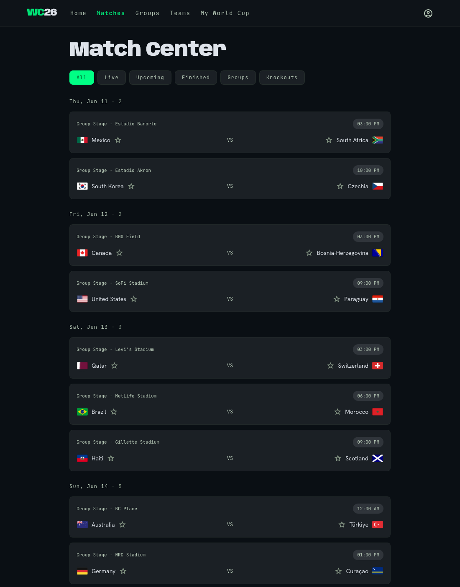
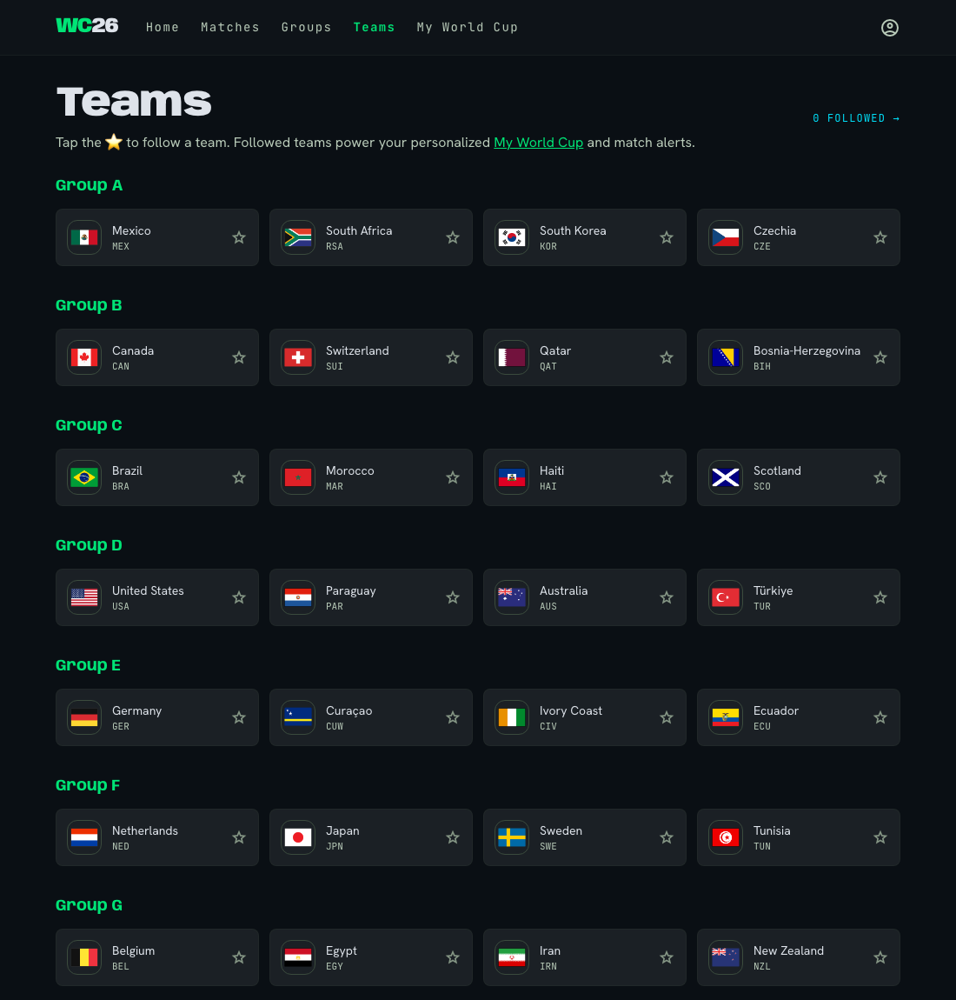
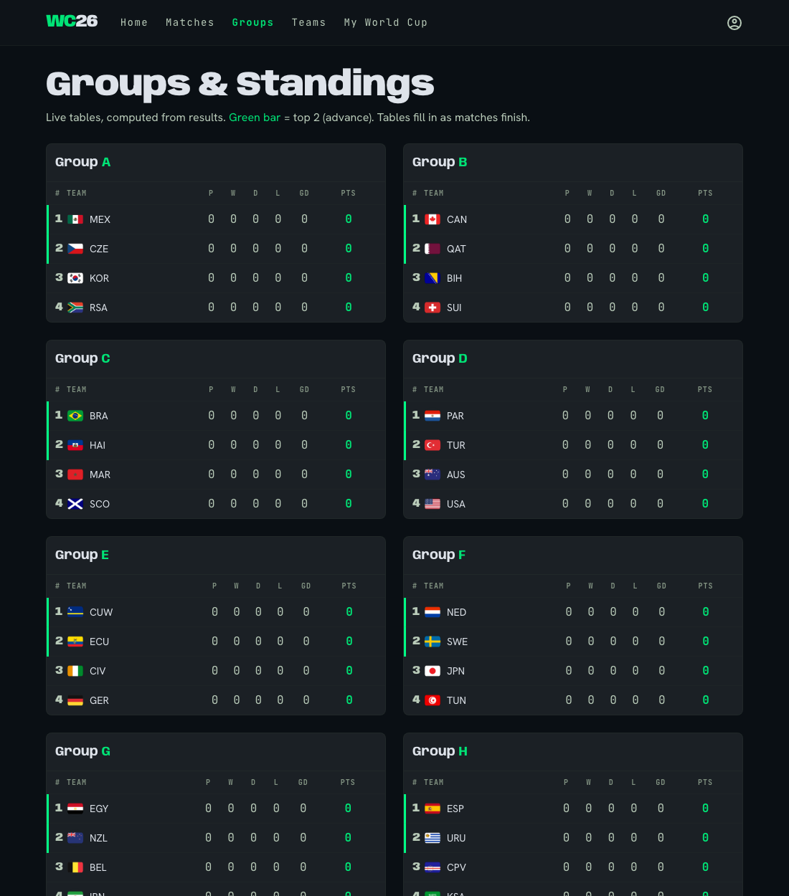
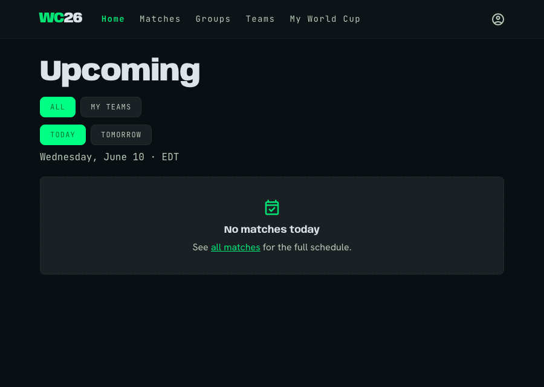

<div align="center">

# ⚽ My World Cup 2026

### Follow your teams at the FIFA World Cup 2026 — live scores, group standings & instant match alerts.

**[▶︎ Live app — mywc.up.railway.app](https://mywc.up.railway.app)**


</div>

A dead-simple, friend-shareable web app for the **first-ever 48-team World Cup**: all teams, all
104 matches, live scores, computed group tables, and **web-push notifications** when your teams kick
off, score, or finish — even when the app is closed. No accounts, no login, **no database**.

Live data comes from **ESPN's free public API** (no key required). The server polls and caches it, so
your visitors only ever hit this app's own API — the upstream is queried politely no matter how much
traffic you get.

---

## 📸 Screenshots

| Match Center | Teams Directory |
| :---: | :---: |
|  |  |
| **Groups & Standings** | **Home — Upcoming** |
|  |  |

> Designed with the **"Pitch Velocity"** system — dark, high-contrast, stadium-green live accents,
> with `Anybody` (display), `Hanken Grotesk` (body) and `JetBrains Mono` (scores/data) type.

---

## ✨ Features

- **🏠 Home = "Upcoming"** — land on today's slate with a scope toggle (**All / My Teams**) and day
  tabs (**Today / Tomorrow**), all rendered in *your* local timezone.
- **⭐ Follow teams** — tap a star to follow; your picks are saved in your browser (`localStorage`),
  so a friend just opens the link and curates their own — no sign-up.
- **🔴 Live scores** — match cards update in place every ~25s with a pulsing **LIVE** badge and the
  current minute.
- **🔔 Web-push alerts** — opt in (per device) to get a phone notification on **kick-off, goal, and
  full-time** for the teams you follow — works even when the app is closed.
- **📊 Live group standings** — 12 group tables computed from results (W/D/L/GF/GA/GD/Pts), with a
  green bar marking the top 2 (who advance).
- **🗂️ My World Cup** — a personalized page: your teams as filter pills (tap one to see *just* that
  team's matches), upcoming fixtures grouped by date, and the alerts toggle.
- **📱 Installable PWA** — add to home screen; offline app-shell; feels like a native app.
- **🌍 48 teams · 12 groups · 104 matches · 16 venues** — the full tournament, group stage through final.

---

## 🧠 How it works

```
                 ┌──────────────────────────── this app (one Express service) ───────────────────────────┐
                 │                                                                                          │
   ESPN public   │   full poller  ──(every 10 min)──▶  iterate 39 dates, normalize ─┐                       │
   API (no key)  │                                                                  ├─▶ in-memory cache ──▶ │  /api/*  ──▶  browser
  site.api.espn  │   live poller  ──(every 25 s)───▶  today's scores, merge in place┘        │              │  (clients never
       .com      │                                                                  diff ─▶ web-push ──────▶ │   touch ESPN)
                 │                                                                                          │
                 └──────────────────────────────────────────────────────────────────────────────────────────┘
                                                                                     │
                                                          subscriptions.json (on a Railway volume)
```

- **The server polls ESPN, never the client.** Two cadences: a *full* refresh (all 104 fixtures, every
  10 min) and a *live* refresh (today's scores, every 25 s, merged in place).
- **Resilient by design** — every fetch has a timeout + retries; a bad refresh keeps the last-good data;
  the server boots and serves immediately even if ESPN is slow, and never crashes on upstream errors.
- **Standings are computed**, not fetched — tallied from finished group-stage results.
- **Notifications**: the live poller diffs each tick against the previous snapshot to detect kick-off
  (`pre→in`), goals (score increased) and full-time (`in→post`), then sends a web-push to every
  subscriber following either team (deduped so you never get the same alert twice).

---

## 🗃️ Data source — ESPN public API

No key, no signup. Base: `https://site.api.espn.com/apis/site/v2/sports/soccer/fifa.world`

| ESPN endpoint | Used for |
| --- | --- |
| `/teams` | the 48 teams (id, name, abbreviation, flag logo) |
| `/scoreboard?dates=YYYYMMDD` | per-day fixtures, scores, status, clock, venue |
| `/news` | optional news feed |

Notes baked into the code: a date-range query caps at ~100 events (so we iterate per-day and de-dupe);
group letters aren't in the feed (so the **draw is a small static config**, validated at boot); knockout
matches arrive as placeholders ("Group B 2nd Place") and are shown verbatim until teams are set.

> ⚠️ ESPN's endpoints are undocumented and unofficial — great for a hobby/community app, but they can
> change without notice and aren't licensed for commercial redistribution.

---

## 🛠️ Tech stack

- **Runtime:** Node.js (≥18), **Express 4**, `compression`
- **Notifications:** [`web-push`](https://github.com/web-push-libs/web-push) (VAPID)
- **Frontend:** vanilla HTML/CSS/JS, **Tailwind** (Play CDN), Google Fonts, Material Symbols — no build step
- **Persistence:** none for app data (in-memory cache); a tiny JSON file for push subscriptions
- **Hosting:** Railway (single service + a small volume)

---

## 📁 Project structure

```
app/
├── server/
│   ├── index.js          Express: static + API routes + resilient boot
│   ├── espn.js           ESPN client (timeout + retries)
│   ├── cache.js          in-memory store + full/live pollers
│   ├── normalize.js      ESPN → Team / Match shapes
│   ├── standings.js      group tables computed from results
│   ├── push.js           VAPID send, subscription store, event detector
│   └── config/groups.js  the static 2026 draw (validated at boot)
├── public/
│   ├── index.html  matches.html  groups.html  teams.html  my.html
│   ├── js/         api, follow, components, ui, live, push + one page-*.js per screen
│   ├── css/app.css        Pitch Velocity base styles
│   ├── sw.js              service worker (offline shell + push)
│   └── manifest.webmanifest
└── package.json
```

---

## 🔌 API reference

All responses are JSON. Times are UTC ISO strings; the client converts to local time.

| Method & path | Description |
| --- | --- |
| `GET /api/health` | readiness, counts, freshness, push status |
| `GET /api/teams` | all 48 teams |
| `GET /api/groups` | 12 groups, each with its teams + computed standings |
| `GET /api/matches` | all matches — filters: `?team=`, `?status=in\|pre\|post`, `?stage=`, `?date=YYYYMMDD` |
| `GET /api/live` | only in-progress matches (polled by the client) |
| `GET /api/push/key` | VAPID public key (`null` if push disabled) |
| `POST /api/push/subscribe` | `{ subscription, teams[] }` — upsert |
| `POST /api/push/unsubscribe` | `{ endpoint }` |

<details>
<summary><b>Example — <code>GET /api/matches</code></b></summary>

```json
[
  {
    "id": "...",
    "date": "2026-06-11T19:00Z",
    "stage": "group-stage",
    "stageLabel": "Group Stage",
    "status": "pre",
    "statusDetail": "Scheduled",
    "clock": null,
    "venue": "Estadio Banorte",
    "home": { "id": "203", "name": "Mexico", "abbr": "MEX", "logo": "https://…/mex.png", "score": "0" },
    "away": { "id": "467", "name": "South Africa", "abbr": "RSA", "logo": "https://…/rsa.png", "score": "0" },
    "isPlaceholder": false
  }
]
```
</details>

<details>
<summary><b>Example — <code>GET /api/groups</code> (one group)</b></summary>

```json
{
  "letter": "A",
  "teams": [ { "id": "203", "name": "Mexico", "abbr": "MEX", "logo": "…", "group": "A" }, … ],
  "standings": [
    { "teamId": "203", "P": 0, "W": 0, "D": 0, "L": 0, "GF": 0, "GA": 0, "GD": 0, "Pts": 0, "rank": 1, "team": { … } }
  ]
}
```
</details>

---

## 🚀 Local development

```bash
npm install
npm start            # → http://localhost:3000
```

Handy environment variables:

| Var | Purpose |
| --- | --- |
| `PORT` | server port (default `3000`; Railway sets this automatically) |
| `LIVE_FEED=all` | point the live poller at ESPN's all-soccer feed so you can see **live cards before the tournament** (verification aid) |
| `VAPID_PUBLIC_KEY` / `VAPID_PRIVATE_KEY` / `VAPID_SUBJECT` | enable web push (generate a pair below) |
| `DATA_DIR` | where the push subscription store lives (default `./data`; a mounted volume in prod) |

Generate a VAPID key pair:

```bash
node -e "console.log(require('web-push').generateVAPIDKeys())"
```

---

## 🔔 Web-push notifications

1. Generate VAPID keys and set `VAPID_PUBLIC_KEY` / `VAPID_PRIVATE_KEY` / `VAPID_SUBJECT`.
2. Open the app on **https** (or `localhost`), go to **My World Cup**, follow a team, and tap **Enable**
   under *Match alerts* → grant the notification permission.
3. The server stores your subscription (in `DATA_DIR/subscriptions.json`) and pushes on goals / kick-off /
   full-time for your teams.

> On iPhone, web push requires **Add to Home Screen** first (iOS 16.4+). Android/desktop Chrome work in-tab.

---

## ☁️ Deploy (Railway)

```bash
railway init                       # new project
railway add -s worldcup            # the app service
railway volume add -m /data        # persistent store for push subscriptions
railway variables --set DATA_DIR=/data \
  --set VAPID_PUBLIC_KEY=… --set VAPID_PRIVATE_KEY=… --set VAPID_SUBJECT=mailto:you@example.com
railway up                         # deploy
railway domain                     # public URL
```

Railway injects `PORT` automatically; no other config is required for the core app (push is optional).

---

## 🗺️ Roadmap ideas

- Knockout bracket view once teams are decided
- Head-to-head tiebreakers in standings
- Share a pre-seeded "my teams" link
- Precompiled Tailwind build (drop the dev-CDN)
- Optional email alerts alongside web push

---

## 📄 License

[MIT](LICENSE) © 2026 Fadi Abbas. Not affiliated with or endorsed by FIFA. Tournament data is
sourced from ESPN's public endpoints and remains the property of its respective owners.
